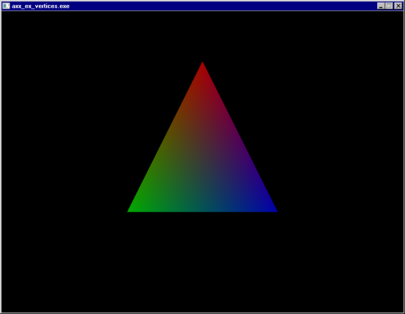

# axxegro

A C++20 header-only wrapper for the game programming library 
[Allegro5](https://github.com/liballeg/allegro5).
It aims to combine the strengths of C++20 and Allegro to provide the most ergonomic
low-level, cross-platform utility possible for creating games or other hardware-accelerated
applications.

The library is still very work-in-progress and is missing a small percentage
of Allegro's features, as well as documentation. However, it already facilitates
far cleaner, more concise and less error-prone code than plain Allegro,
while achieving zero or negligible overhead.

The best way to get started right now is to look at the [examples](examples/src).
A series of tutorials will be written in the future to make axxegro accessible.

Work-in-progress also means that the API is completely unstable and might change
on any scale at any time.

# main features so far

- Full RAII for everything
- Even more RAII (scoped transforms, target bitmaps etc.)
- Wrappers for most of Allegro
- Built-in homebrew `Vec*` and `Rect` classes for screen coordinate manipulation
- An `EventLoop` class that handles boilerplate for basic programs
- Template-powered user event support
- Type-safe audio processing
- Type-safe bitmap locking
- `constexpr` colors and helper functions
- opt-out automatic addon initialization
- exceptions for common failure points (no more mysterious segfaults 
    when you forget to `al_init()` or misspell a filename)


# showcase

The following snippets showcase selected axxegro features.

For complete example programs with explanatory comments, see [examples/src](examples/src).

## The Hello World triangle
```c++
#include <axxegro/axxegro.hpp>

int main() {
	al::Display display(800, 600);
	
	std::vector<al::Vertex> vertices = {
		{.pos = {400, 100, 0}, .uvPx = {0, 0}, .color = al::Red},
		{.pos = {250, 400, 0}, .uvPx = {0, 0}, .color = al::Green},
		{.pos = {550, 400, 0}, .uvPx = {0, 0}, .color = al::Blue}
	};
	
	al::TargetBitmap.clearToColor(al::RGB(0,0,0));
	al::DrawPrim<al::Vertex>(vertices);
	al::CurrentDisplay.flip();
	
	al::Sleep(1.0);
}

```


## Loading and drawing a bitmap

```c++
al::Bitmap lena("lena.jpg");
/* ... */
lena.draw({0, 0});
```


## Basic event loop
```c++
al::EventLoop loop(al::DemoEventLoopConfig);

//or, equivalently: 
al::EventLoop loop(EventLoopConfig {
    .autoRegisterEvents = al::KeyboardEventSourceBit | al::MouseEventSourceBit | al::CurrentDisplayEventSourceBit,
    .enableQuitTriggers = al::QuitOnDisplayClosedBit | al::QuitOnEscPressedBit,
    .autoAcknowledgeResize = true,
    .framerateLimit = al::FramerateLimiterMode::Auto{}
});

//config can be modified, for example:
using namespace al::Literals;
loop.setFramerateLimit(60_Hz);

//do something when we press enter
loop.eventDispatcher.onKeyDown(ALLEGRO_KEY_ENTER, [&](){
    doSomething();
});

loop.run([&](){
    al::TargetBitmap.clearToColor(al::Black);
    handleInput();
    render();
    al::CurrentDisplay.flip();
});
```

## Using an event queue manually
```c++
al::EventQueue queue;
queue.registerSource(al::GetKeyboardEventSource());
queue.registerSource(al::CurrentDisplay.eventSource());

for(bool exit = false; !exit; ) {
	al::EventOwner event = queue.wait();
	if(event.get().type == ALLEGRO_EVENT_DISPLAY_CLOSE) {
		exit = true;
	}
	/* etc... */
}
```

## Bitmap locking
```c++

al::Bitmap fractal(512, 512);

auto region = fractal.lock<al::PixelARGB8888>();
for(int y=0; y<region.height(); y++) {
	auto row = region.row(y);
	for(int x=0; x<row.size(); x++) {
		row[x].set(0x000000);
		row[x].g = mandelbrot(x, y);
	}
}

```

There's a ton more exciting stuff I haven't shown here, so feel free to explore :)

# Compiler support

Tested on GCC 13.1 and Clang 15.

# Building

Examples and documentation can be built with CMake:

```bash
mkdir build
cd build
cmake ..
make -j $(nproc)
```

If Allegro can be found by CMake, no further configuration is required.
If you prefer to not install Allegro to your toolchain/system path, you may
specify a custom `CMAKE_PREFIX_PATH`.

# Integration

Allegro needs to be installed separately. Refer to the [Allegro Wiki](https://github.com/liballeg/allegro_wiki/wiki)
for installation instructions.

Since axxegro is plain C++20, it is enough to copy the headers to a working Allegro5 project
and compile with `-I<path_to_axxegro>`.

It is also supported to use axxegro as a subdirectory in a CMake project:
```cmake
add_subdirectory(axxegro)
target_link_libraries(my_game axxegro)
```
which will handle the Allegro dependency automatically, as long as it is installed
somewhere CMake can find it.

If you are using shared Allegro libraries on Windows, you can place DLLs in /dll
and CMake will copy them to your build automatically.

### Coming soon™:
 - CMake installation and package config files
 - vcpkg support
 - conan support
 - Arch PKGBUILD

# development progress

As I'm writing this, the library is about 80% done.
Everything in Allegro has an axxegro equivalent, except
the following missing things:

### high priority
 - a subset of gfx routines (blending modes)
 - platform-specific and functions
 - native dialog menus

### medium priority
 - virtual filesystem, PhysicsFS and memfile
 - some audio features (devices etc)
 - haptic
 - joystick
 - state
 - system routines
 - touch input
 - make addons optional like in plain allegro

### low priority / won't be done
 - fixed point math (consider this instead: https://github.com/MikeLankamp/fpm)
 - threads (C++ has std::thread)
 - path structures (C++ has std::filesystem::path)


# docs

(WARNING docs are very incomplete at the moment and will probably move to
something other than doxygen)

Documentation will be generated and placed in `build/docs` if Doxygen is found
and `AXXEGRO_BUILD_DOCS` is set to ON (which is the default for `AXXEGRO_MASTER_PROJECT`)

# credits

axxegro builds on the excellent work of the creators of Allegro 5: https://github.com/liballeg/allegro5
